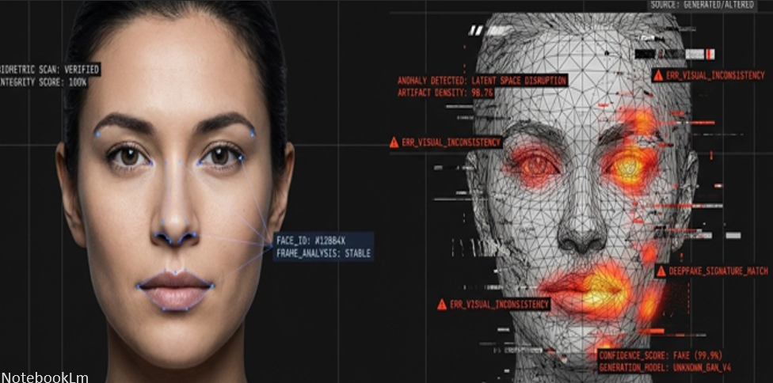
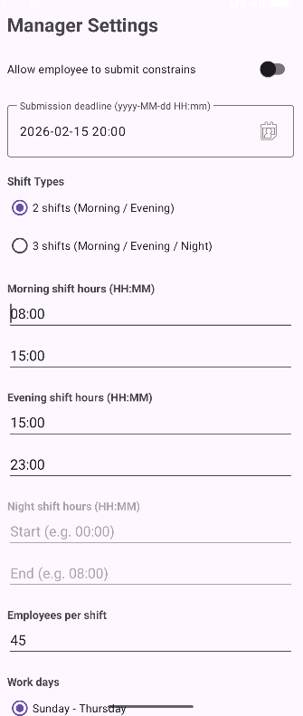
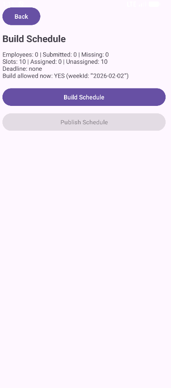

<h1 align="center">Hi 👋 I'm Menaluc</h1>

  <strong>Final-year Computer Science student</strong> 
  Backend Developer in progress • AI • Real-world systems

  

## About Me

I’m a final-year Computer Science student with a strong interest in backend development and practical AI systems.

I enjoy building end-to-end projects that connect models, APIs, and product thinking into real applications.

- Backend-focused, currently strengthening **Node.js**
- Experience in **Machine Learning** and **Deep Learning**
- Interested in building systems from **model → API → product**
- Fast learner with a strong problem-solving mindset

---

## Tech Stack

  

---

## Featured Projects

### RealVision - Deepfake Detection System

  

  <strong>AI-powered system for detecting manipulated videos using Deep Learning and Explainable AI</strong>

- Deepfake detection model for **Real vs Fake** classification
- **Node.js REST API** for video upload and prediction
- Integration of **Computer Vision + Backend**
- **Grad-CAM** for model interpretability

---

### MyShiftApp - Shift Management System

  
  

  <strong>Android-based system for managing employee constraints and schedule generation</strong>

- **Role-based system** for Employee and Manager
- Employee availability and constraints submission
- Manager settings and schedule generation flow
- Built with **Firebase** and **MVVM architecture**

---

## Career Goal

I’m looking for a **junior backend / software developer role** where I can continue learning, grow through real engineering work, and contribute to practical systems.
